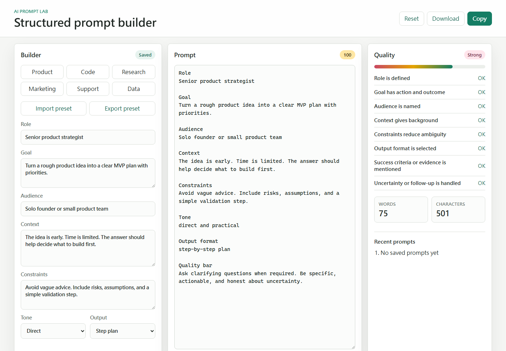

# AI Prompt Lab

AI Prompt Lab 是一個靜態瀏覽器工具，用表單欄位把粗略的 AI 任務整理成可複製、可下載、可匯出 preset 的 prompt。

## 狀態

這是早期個人專案。它目前可以當作靜態 prompt builder 使用，但分數規則只是簡單 heuristic，不應該被當成真正的 AI 評分系統。

這個工具沒有後端。prompt 內容、preset、最近使用紀錄都留在瀏覽器內，除非你自己複製、下載或匯出。

## 目前版本

v0.4.0 是第一個可用的靜態版本。下一個小版本會先處理新模板、preset 管理和 accessibility coverage。

## Demo

```text
https://greg59701029.github.io/ai-prompt-lab/
```



## 目前功能

- 完全在瀏覽器內執行，不需要 API key
- 用角色、目標、受眾、背景、限制、語氣、輸出格式建立 prompt
- 內建產品規劃、程式任務、研究摘要、行銷簡報、客服回覆、資料分析和學習計畫模板
- 用 8 個固定規則檢查 prompt：角色、目標、受眾、背景、限制、格式、證據、不確定性
- 匯出可再次編輯的 JSON preset
- 下載產生的 prompt 文字檔
- 用 `localStorage` 保存最近 5 個複製或下載過的 prompt

## 已知限制

- prompt 分數是 rule-based，可能漏掉好 prompt，也可能獎勵冗長 prompt。
- 最近紀錄只存在 `localStorage`。
- 沒有同步、帳號系統或後端。
- preset 匯入只驗證支援欄位，不判斷語意品質。
- 目前模板只是起點，不是特定模型的最佳實務。

## 本機使用

```bash
python -m http.server 8080
```

然後開啟：

```text
http://localhost:8080
```

也可以直接用瀏覽器開 `index.html`。

## 測試

```bash
python tests/smoke_test.py
node tests/prompt_core.test.js
npm run test:e2e
```

如果要跑 Playwright E2E，先執行：

```bash
npm install
npx playwright install --with-deps chromium
```

## Roadmap

目前下一步直接追蹤在 GitHub issues：

- #1 preset 管理
- #2 prompt diff view
- #3 learning prompt template
- #4 accessibility coverage

## 授權

MIT
